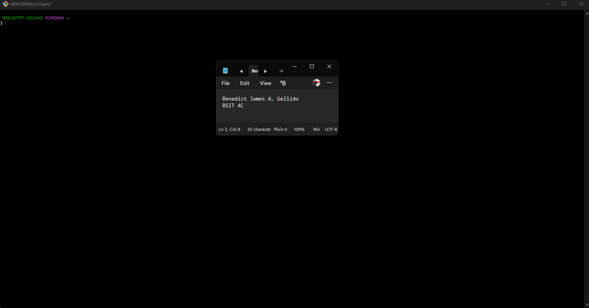
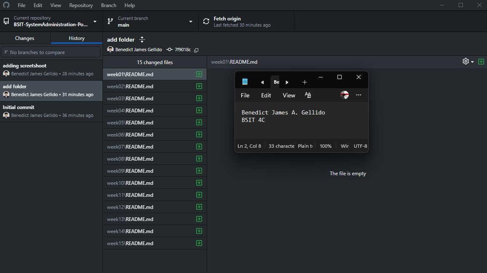
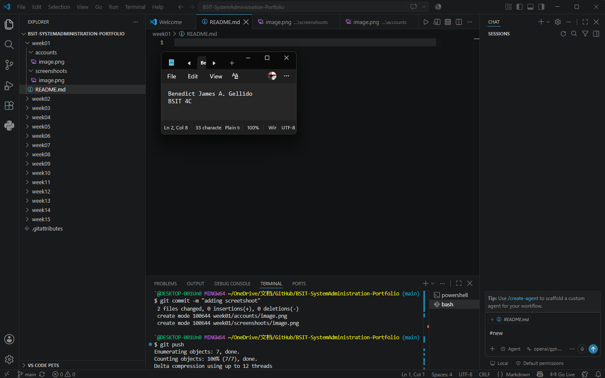
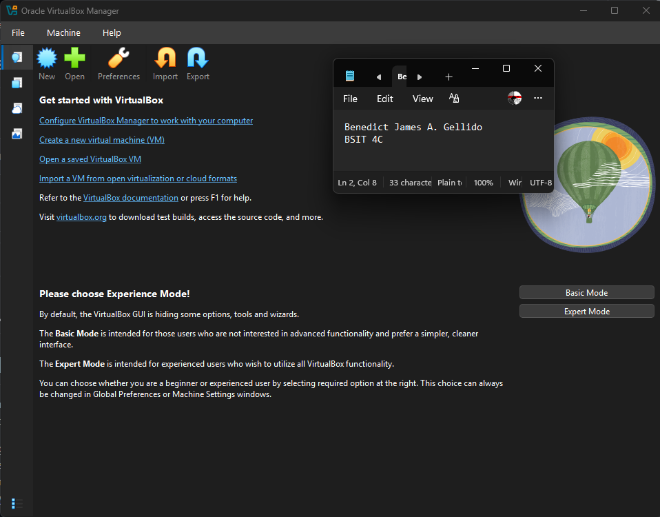
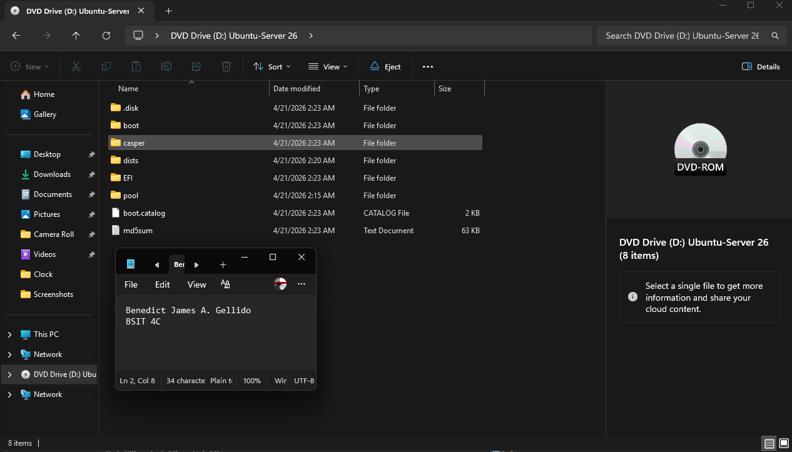
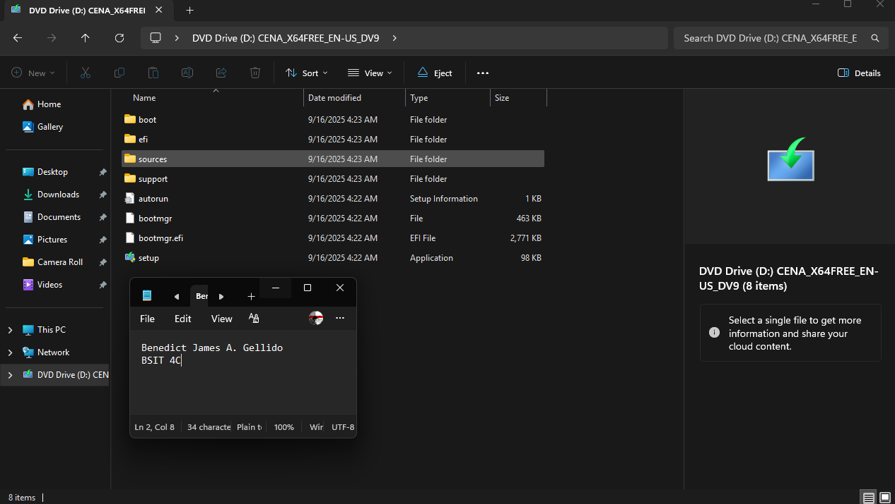

# Week 1 – Building My Professional Environment

## Student Information

| Information | Details |
|-------------|---------|
| **Name** | Benedict James A. Gellido |
| **Course** | BSIT |
| **Section** | 4C |
| **Date** | August 6, 2026 |

---

# Objectives

- Understand the lessons and concepts taught in class.
- Improve my knowledge and skills through active participation and practice.
- Develop critical thinking and problem-solving skills.
- Complete all school activities and assignments on time.
- Achieve good academic performance while continuously improving my learning abilities.

---

# Software Installed

- ✅ Git
- ✅ GitHub Desktop
- ✅ Visual Studio Code
- ✅ VirtualBox

---

# Professional Accounts

- **GitHub:** https://github.com/youngstunna02
- **LinkedIn:** https://www.linkedin.com/in/benedict-james-gellido-6b9607324

---

## Git Installation

## GitHub Desktop Installation

## Visual Studio Code Installation

## VirtualBox Installation

## Ubuntu Server ISO Download

## Windows 11 Enterprise Evaluation ISO Download

--- 

# Challenges Encountered

## 1. Git Installation

**Challenge:**
- Unsure of the installation settings.

**Solution:**
- Used the default installation settings and verified the installation using the Git terminal.

---

## 2. VirtualBox Installation

**Challenge:**
- The installer required administrator permission.

**Solution:**
- Ran the installer as an administrator and restarted the computer after installation.

---

## 3. GitHub and LinkedIn Setup

**Challenge:**
- Email verification and profile setup.

**Solution:**
- Verified the email address and completed all required profile information.

---

# Reflection

During this activity, I learned the importance of installing and setting up essential tools used in the IT field, including Git, GitHub Desktop, Visual Studio Code, and VirtualBox. Although the installation process seemed simple at first, I realized that careful attention to each step is necessary to ensure that the software works properly. I also learned how to create and configure GitHub and LinkedIn accounts, which are valuable platforms for collaboration, version control, and professional networking.

One of the most valuable lessons I gained was understanding how these tools work together in a real-world environment. Git and GitHub help developers and system administrators manage changes, collaborate on projects, and maintain backup copies of important files. Visual Studio Code provides an efficient environment for writing and editing scripts, while VirtualBox allows users to create virtual machines for testing different operating systems without affecting the main computer.

This activity also improved my problem-solving skills as I encountered minor installation and account setup issues that required patience and careful troubleshooting. By following instructions and verifying each step, I was able to complete the setup successfully.

As a future System Administrator, I believe these tools will play a significant role in my career. They will help me manage systems efficiently, automate tasks, test configurations safely, and collaborate effectively with other IT professionals. Overall, this activity strengthened my technical foundation and increased my confidence in using industry-standard tools that I will continue to use throughout my studies and future career.

---

# References

1. Git. (n.d.). https://git-scm.com/
2. GitHub. (n.d.). https://github.com/
3. Microsoft. (n.d.). https://code.visualstudio.com/
4. Oracle. (n.d.). https://www.virtualbox.org/
5. LinkedIn. (n.d.). https://www.linkedin.com/