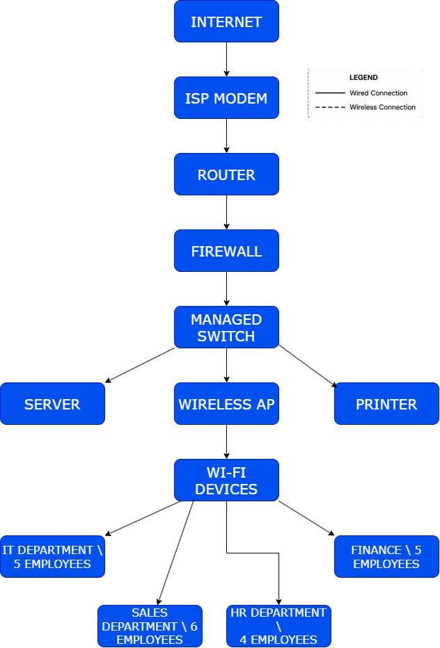

## 1. Company Profile

### Company Name

**ABC Startup Solutions**

### Nature of Business

ABC Startup Solutions is a newly established software development company that provides software development and IT solutions to businesses and organizations.

### Company Vision

To become a trusted and innovative software development company that provides reliable technology solutions and contributes to the digital growth of businesses.

### Company Mission

To develop reliable, secure, and user-friendly software solutions while providing quality IT services that meet the needs of clients and support their business operations.

### Office Location

**Fictional Location:**  
Innovation Avenue, Laguna Technology Park  
Santa Rosa, Laguna, Philippines

### Organizational Structure

ABC Startup Solutions is composed of four main departments: Information Technology, Human Resources, Finance, and Sales. The company has a total of 20 employees distributed among these departments, with each department responsible for supporting the company's daily operations and business objectives.

### Employee Distribution

| Department | Number of Employees | Main Function |
|---|---:|---|
| Information Technology | 5 | Software development, IT support, and infrastructure |
| Human Resources | 4 | Employee management and administrative functions |
| Finance | 5 | Financial records, budgeting, and accounting |
| Sales | 6 | Client relations, sales, and business development |
| **Total** | **20** | |

## 2. Enterprise Hardware Inventory

The hardware inventory identifies the physical IT equipment required by ABC Startup Solutions to support its 20 employees and daily business operations. The selected hardware is based on the company's four departments: Information Technology, Human Resources, Finance, and Sales.

| Asset ID | Hardware | Quantity | Department | Purpose |
|---|---|---:|---|---|
| HW-001 | Desktop Computers | 15 | IT, HR, Finance, Sales | Primary workstations for employees performing office, administrative, financial, sales, and development tasks |
| HW-002 | Laptops | 5 | IT, HR, Finance, Sales | Portable workstations for employees who require mobility, meetings, or flexible work arrangements |
| HW-003 | Server | 1 | IT | Provides centralized storage, application hosting, user management, and internal services |
| HW-004 | Router | 1 | IT | Connects the company's internal network to the internet and manages network traffic |
| HW-005 | Switch | 1 | IT | Connects computers, server, printer, and other wired network devices |
| HW-006 | Printer | 2 | HR, Finance | Provides printing for employee records, financial documents, reports, and other business documents |
| HW-007 | UPS | 3 | IT | Provides backup power and protects the server and critical networking equipment from power interruptions |
| HW-008 | Wireless Access Point | 2 | IT | Provides wireless network access throughout the single-floor office |
| HW-009 | NAS Storage | 1 | IT | Provides centralized network storage for shared files and backups |
| HW-010 | External Backup Drive | 2 | IT | Provides additional offline backup copies of important company data |
| HW-011 | Monitors | 20 | IT, HR, Finance, Sales | Provides displays for desktop and laptop workstations |

### Hardware Selection Justification

The hardware quantities were selected based on the company's 20 employees and its need to establish an IT infrastructure from scratch.

- **15 Desktop Computers and 5 Laptops:** A total of 20 computers provides one primary workstation for each employee. Laptops are assigned to employees who may require mobility for meetings, presentations, or flexible work arrangements.
- **1 Server:** One server is sufficient as an initial centralized system for a small 20-person startup. It can support services such as file storage, application hosting, and user management.
- **1 Router and 1 Switch:** These devices provide the basic wired network infrastructure and allow the company's computers and other network devices to communicate and access the internet.
- **2 Printers:** Two printers provide convenient access for departments that regularly handle physical documents, particularly HR and Finance.
- **3 UPS Units:** UPS devices provide backup power and protection for the server and critical networking equipment during short power interruptions.
- **2 Wireless Access Points:** Two access points are planned to provide wireless coverage throughout the company's single-floor office.
- **1 NAS Storage:** The NAS provides centralized network storage for shared company files and backup purposes.
- **2 External Backup Drives:** External drives provide additional offline copies of important company data as part of the company's backup strategy.
- **20 Monitors:** One monitor is provided for each employee workstation to support daily business and technical activities.

## 3. Enterprise Software Inventory

The software inventory identifies the applications and operating systems required to support the daily operations, software development, system administration, communication, and security needs of ABC Startup Solutions.

| Software | Version | License | Purpose |
|---|---|---|---|
| Windows 11 Pro | Windows 11 Pro 25H2 | Commercial | Primary operating system for company desktop computers and laptops |
| Ubuntu Server | Ubuntu Server 24.04 LTS | Open Source | Server operating system for hosting services, applications, and centralized resources |
| Microsoft Office | Microsoft 365 Apps | Subscription | Provides productivity applications for documents, spreadsheets, presentations, and business tasks |
| Visual Studio Code | Latest Stable Version | Free / Open Source | Used by the IT department for software development, scripting, and configuration |
| Git | Latest Stable Version | Open Source | Used for version control and managing software development projects |
| GitHub Desktop | Latest Stable Version | Free | Provides a graphical interface for managing Git repositories and synchronizing projects with GitHub |
| VirtualBox | Latest Stable Version | GPLv3 / Free | Allows IT personnel to create and manage virtual machines for testing and system administration |
| Google Chrome | Latest Stable Version | Free / Proprietary | Web browser for accessing web applications, online services, documentation, and company resources |
| Microsoft Defender | Included with Windows 11 Pro | Included with Windows | Provides antivirus and security protection against malware and other threats |
| AnyDesk | Latest Stable Version | Proprietary / Commercial | Provides remote desktop access for IT support and troubleshooting |
| 7-Zip | Latest Stable Version | Open Source | Used for file compression, extraction, and management of compressed files |

### Software Selection Justification

The selected software provides the essential operating systems, productivity tools, development applications, administrative utilities, and security tools required by ABC Startup Solutions.

- **Windows 11 Pro:** Provides the primary operating system for employee computers and supports business and administrative activities.
- **Ubuntu Server:** Provides a reliable server operating system for hosting internal services and applications.
- **Microsoft Office:** Provides essential productivity applications such as word processing, spreadsheets, and presentations for daily business operations.
- **Visual Studio Code:** Supports the IT department in software development, scripting, and configuration tasks.
- **Git:** Provides version control so developers can track changes and collaborate on software projects.
- **GitHub Desktop:** Makes Git repository management easier through a graphical interface and supports the company's development workflow.
- **VirtualBox:** Allows the IT department to create virtual machines for testing different operating systems, applications, and configurations without affecting production systems.
- **Google Chrome:** Provides employees with a web browser for accessing websites, web applications, cloud services, and online resources.
- **Microsoft Defender:** Provides built-in protection against malware and other security threats on Windows computers.
- **AnyDesk:** Allows authorized IT personnel to remotely access computers when providing technical support and troubleshooting.
- **7-Zip:** Provides file compression and extraction capabilities, which are useful for managing software packages, backups, and compressed files.

## 4. Enterprise Network Inventory

The enterprise network inventory identifies the networking equipment required to establish a reliable and secure network for ABC Startup Solutions. The selected equipment supports internet connectivity, network communication, wireless access, security, and structured cabling for the company's 20 employees.

| Asset ID | Network Equipment | Quantity | Department | Purpose |
|---|---|---:|---|---|
| NET-001 | ISP Modem | 1 | IT | Provides the connection between the company's network and the Internet Service Provider |
| NET-002 | Router | 1 | IT | Routes network traffic between the internal network and the internet |
| NET-003 | Firewall | 1 | IT | Protects the internal network by monitoring and controlling incoming and outgoing network traffic |
| NET-004 | Managed Switch | 1 | IT | Connects wired computers, servers, printers, and other network devices within the local network |
| NET-005 | Wireless Access Point | 2 | IT | Provides wireless network connectivity throughout the single-floor office |
| NET-006 | Patch Panel | 1 | IT | Organizes and manages Ethernet connections between network cables and the network switch |
| NET-007 | CAT6 Ethernet Cables | 30 | IT | Provides wired network connections between computers, network devices, and network infrastructure |
| NET-008 | RJ45 Connectors | 50 | IT | Used to terminate CAT6 Ethernet cables and create network connections |

### Network Equipment Selection Justification

The selected networking equipment is designed to provide ABC Startup Solutions with a reliable and secure network infrastructure suitable for a 20-employee startup.

- **ISP Modem:** One modem is required to establish the company's internet connection with the selected Internet Service Provider.
- **Router:** One router manages communication between the company's internal network and the internet.
- **Firewall:** One firewall provides an additional layer of network security by controlling and monitoring network traffic.
- **Managed Switch:** One switch connects the company's wired devices, including computers, server, printer, and other network equipment.
- **Wireless Access Points:** Two access points are planned to provide wireless coverage throughout the company's single-floor office.
- **Patch Panel:** One patch panel provides an organized termination point for the office's Ethernet cables and makes network maintenance easier.
- **CAT6 Ethernet Cables:** Thirty CAT6 cables provide enough connections for employee workstations and network devices while allowing additional connections for future expansion.
- **RJ45 Connectors:** Fifty RJ45 connectors provide additional connectors for cable termination, replacement, maintenance, and future network expansion.

## 5. Enterprise Network Diagram

The enterprise network topology was designed using Draw.io to represent the proposed network infrastructure of ABC Startup Solutions. The diagram shows the logical connections between the Internet, ISP modem, router, firewall, managed switch, server, wireless access point, printer, Wi-Fi devices, and the company's four departments.

### Network Topology

**Diagram Title:** Enterprise Network Topology – ABC Startup Solutions  
**Prepared by:** Benedict James A. Gellido  
**Design Tool:** Draw.io

### Network Flow

The network follows a logical connection from the Internet to the ISP modem, router, firewall, and managed switch. The managed switch provides connectivity to the server, printer, wireless access point, and the IT, HR, Finance, and Sales departments.